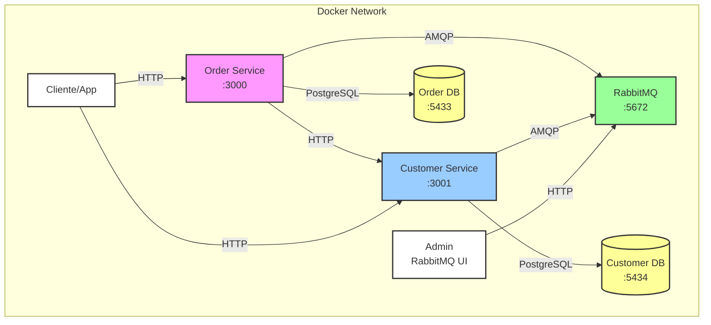

# Monokera - Sistema de Gestión de Pedidos y Clientes

Este repositorio contiene dos servicios RESTful desarrollados con Ruby on Rails que trabajan juntos para proporcionar funcionalidades de gestión de pedidos y clientes, orquestados con Docker Compose.

## Estructura del Proyecto

- `order_service/` - Servicio de gestión de pedidos (API)
- `customer_service/` - Servicio de gestión de clientes (API)
- `docker-compose.yml` - Configuración de orquestación con Docker
- `scripts/` - Scripts de utilidad para el desarrollo

## Requisitos

- Docker 20.10.0 o superior
- Docker Compose 2.0.0 o superior

## Configuración Inicial

1. Clona el repositorio:
   ```bash
   git clone [URL_DEL_REPOSITORIO]
   cd challenge-monokera
   ```

## Iniciar los Servicios

2. Construir y levantar todos los servicios:
- **order_service**: Servicio de pedidos (puerto 3000)
- **customer_service**: Servicio de clientes (puerto 3001)
- **order_db**: Base de datos PostgreSQL para pedidos (puerto 5433)
- **customer_db**: Base de datos PostgreSQL para clientes (puerto 5434)
- **rabbitmq**: Servicio de mensajería (puerto 5672 para AMQP y 15672 para la interfaz web)

```bash
docker-compose up -d --build
```

3. Ejecutar migraciones y seeds:

```bash
./scripts/db_init.sh
```

4. Iniciar el consumidor de RabbitMQ, no cerrar la terminal, dejar el servicio en ejecución de rabbitmq:

```bash
./scripts/start.sh
```

5. Es todo, ya puedes acceder a las APIs de los servicios:

| Método | Endpoint | Descripción |
|--------|----------|-------------|
| `GET`  | `http://localhost:3001/customers` | Listado de todos los clientes |
| `GET`  | `http://localhost:3001/customers/1` | Detalle de un cliente específico |
| `GET`  | `http://localhost:3000/orders` | Listado de todos los pedidos |
| `GET`  | `http://localhost:3000/orders?customer_id=2` | Listado de pedidos de un cliente específico |
| `POST` | `http://localhost:3000/orders` | Crear un nuevo pedido |

6. ejecutar test
```bash
./scripts/order_service_test.sh
./scripts/consumer_service_test.sh
```

## Comandos Útiles que puedes usar en la terminal (recuerda que estan los scripts para facilitar su uso)

### Orden Service

```bash
# Ejecutar migraciones order_service
docker-compose exec order_service rails db:migrate

# Acceder a la consola de Rails de order_service
docker-compose exec order_service rails console
```

### Customer Service

```bash
# Ejecutar migraciones
docker-compose exec customer_service rails db:migrate

# Acceder a la consola de Rails
docker-compose exec customer_service rails console
```

### Gestión de Contenedores

```bash
# Ver logs de todos los servicios
docker-compose logs -f

# Detener todos los servicios
docker-compose down

# Reconstruir y reiniciar un servicio específico
docker-compose up -d --build [nombre_servicio]
```

## Documentación de las APIs

### Customer Service

#### Listar clientes
```
GET http://localhost:3001/customers
```

#### Obtener un cliente específico
```
GET http://localhost:3001/customers/:id
```

### Order Service

#### Listar pedidos
```
GET http://localhost:3000/orders
```

#### Crear un nuevo pedido
```
POST http://localhost:3000/orders
{
  "customer_id": 1,
  "order_date": "2025-10-04",
  "status": "pending",
  "total": 99.99
}
```

## Desarrollo

### Reconstruir servicios después de cambios

```bash
docker-compose up -d --build
```

### Reset de servicios

```bash
docker-compose down --volumes
```

## Variables de Entorno

Cada servicio tiene su propio archivo `.env` con las siguientes variables:
(los .env no fueron ignorados ya que son datos genericos de conexion y para facilitar que los revisores puedan hacer pruebas)

### Customer Service
- `DATABASE_URL`: URL de conexión a la base de datos
- `RACK_ENV`: Entorno de ejecución
- `PORT`: Puerto del servicio (3001)
- `RABBITMQ_URL`: URL de conexión a RabbitMQ

### Order Service
- `DATABASE_URL`: URL de conexión a la base de datos
- `RACK_ENV`: Entorno de ejecución
- `PORT`: Puerto del servicio (3000)
- `RABBITMQ_URL`: URL de conexión a RabbitMQ
- `CUSTOMER_SERVICE_URL`: URL del servicio de clientes



## Licencia

Este proyecto está bajo la Licencia MIT.
